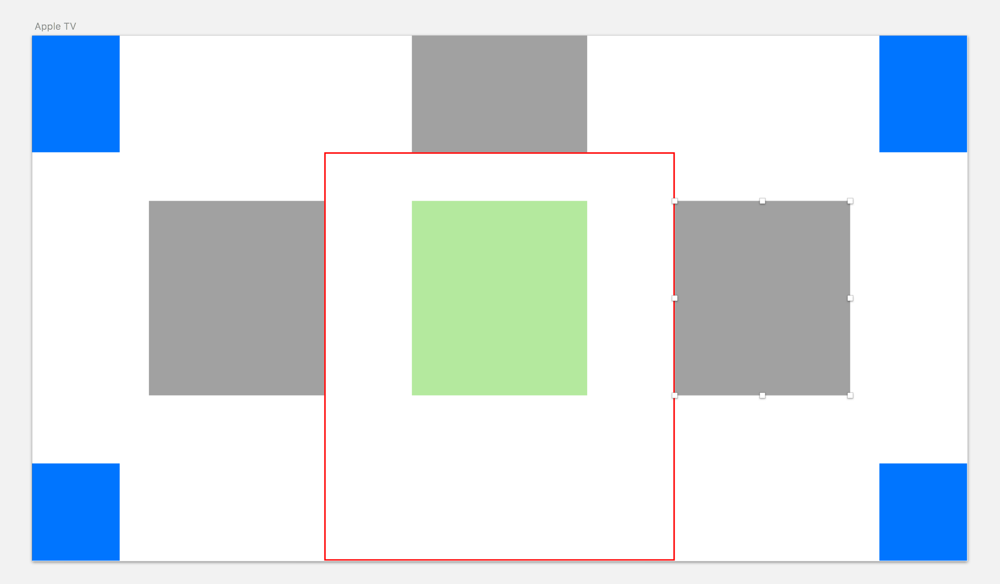

##  Gallary-by-React

该项目是来自慕课网的实战项目 - [React实践图片画廊应用（下）](https://www.imooc.com/learn/652)，原实战教程中，所用到的脚手架为 [yeoman](http://yeoman.io/) 中的 [generator-react-webpack](https://github.com/react-webpack-generators/generator-react-webpack#readme) 进行搭建，但是该脚手架已经快一年没有更新，而且其 2.0 版本也与食品教程中的项目结构都不一致，因此在该项目中使用了 React 官方团队维护的 [creat-react-app](https://github.com/facebookincubator/create-react-app) 作为脚手架搭建项目。

项目中使用 es6 的语法，并且对各个组件和功能模块进行了拆分，实现可复用，高定制的效果。

### 技术栈
- ES6
- React(version: 16.1)
- webpack(version: 3)
- creat-react-app
- sass / scss suport

### 踩坑
1.  安装脚手架

    ```bash
    $ npm install -g create-react-app
    ```

2.  使用脚手架新建项目

    ```bash
    $ create-react-app my-project
    $ cd my-project
    $ npm start
    ```

3.  处理 scss/sass 文件

    ####   处理方法一（脚手架[官方推荐](https://github.com/facebookincubator/create-react-app/blob/master/packages/react-scripts/template/README.md#adding-a-css-preprocessor-sass-less-etc)）：

    先安装  [node-sass-chokidar](https://github.com/michaelwayman/node-sass-chokidar)  ： `yarn add node-sass-chokidar`

    在 `package.json` 添加新的命令：

    ```json
    {
    "scripts": {
        "build-css": "node-sass-chokidar src/ -o src/",
        "watch-css": "npm run build-css && node-sass-chokidar src/ -o src/ --watch --recursive",
        "start-js": "react-scripts start",
        "start": "npm-run-all -p watch-css start-js",
        "build-js": "react-scripts build",
        "build": "npm-run-all build-css build-js",
    }
    }
    ```

    至于为什么使用该插件而不直接使用 node-sass 配合 sass-loader，官方给出了这样的答案：

    >   **Why node-sass-chokidar?**
    >     `node-sass` has been reported as having the following issues:
    >
    >   -   `node-sass --watch` has been reported to have *performance issues* in certain conditions when used in a virtual machine or with docker.
    >   -   Infinite styles compiling [#1939](https://github.com/facebookincubator/create-react-app/issues/1939)
    >   -   `node-sass` has been reported as having issues with detecting new files in a directory [#1891](https://github.com/sass/node-sass/issues/1891)
    >       `node-sass-chokidar` is used here as it addresses these issues.

    ####   处理方法二：

    脚手架原生的项目仅支持 css 文件。如果需要 webpack 处理 scss/sass 的文件的话，需要手动修改 webpack 的配置，该配置文件为： `./node_modules/react-scripts/config/webpack.config.dev.js` 和 `./node_modules/react-scripts/config/webpack.config.dev.js`。在该俩文件中的 添加下列代码：

    ```javascript
    module.exports = {
      ...
      module: {
      rules: [{
        test: /\.scss$/,
        use: [
              require.resolve('style-loader'),
              {
                  loader: require.resolve('css-loader'),
                  options: {
                      importLoaders: 1,
                  },
              },
              {
                  loader: require.resolve('postcss-loader'),
                  options: {
                      // Necessary for external CSS imports to work
                      // https://github.com/facebookincubator/create-react-app/issues/2677
                      ident: 'postcss',
                      plugins: () => [
                          require('postcss-flexbugs-fixes'),
                          autoprefixer({
                              browsers: [
                                  '>1%',
                                  'last 4 versions',
                                  'Firefox ESR',
                                  'not ie < 9', // React doesn't support IE8 anyway
                              ],
                              flexbox: 'no-2009',
                          }),
                      ],
                  },
              },
              {
                  loader: require.resolve('sass-loader')
              }
          ]
      }]
    }
    }	
    ```

    ​

4.  分析图片放置位置

    如下图所示：

    

    绿色为居中图片的位置。

    红色框内为安全区域，范围是居中左右各半个图片宽度，上方为半个图片宽度。

    灰色是安全区域外的极限布局位置。可以得知，安全区域左边的 x 的取值最大应该为**舞台的一半宽度 - 一个图片宽度 - 半个图片宽度**，安全区域右边的 x 的取值最小值应为**舞台一半宽度 + 半个图片宽度**，安全区域上方的 x 的取值应为 **舞台一半宽度 - 一个图片宽度**（即图片左边框紧贴安全区域左侧） 至 **舞台一半宽度 + 半个图片宽度**（即图片右边框紧贴安全区域右侧）。

    蓝色为图片在四个角最少需要漏出 1/4 的区域。所以，两侧的 y 的取值应为 **负半个图片宽度** 至 **舞台总高度 - 半个图片宽度**。

5.  编写辅助函数

    因为图片都散列排布，所以会大量用到 `Math.random` 进行随机取值，所以随意取值应写入辅助函数当中。同时，生成图片排布的位置取值范围应保存为一个常量，同时生成函数也应写入辅助函数中：

    随机数的生成：

    ```javascript
    /**
     * 
     * @param {Int} low 随机数最小值，若只有 low 则为最大值，最小值为 0。
     * @param {Int} height 随机数最大值，若不传，则 low 为最大值。
     */
    const random = (low, height) => {
        if (low !== undefined && height !== undefined) {
            return ~~(Math.random() * (height - low) + low)
        } else if (low !== undefined) {
            return ~~(Math.random() * low)
        } else {
            return Math.random()
        }
    }

    // 随机生成位置
    const pos = (low, height) => random(low, height)

    // 随机生成一个角度
    const deg = () => ~~(Math.random() * 30 * (random() > 0.5 ? 1 : -1))

    export default {
        pos,
        deg,
        random
    }
    ```

    取值范围的生成：

    ```javascript
    /**
     * 生成图片位置范围函数
     * 传入参数依次为 舞台宽，舞台高，图片宽
     */
    export default (stageWidth, stageHeight, imgWidth, imgHeight) => {
        // 保存舞台一半的宽高，和图片的一半宽高
        let stageHalfWidth = stageWidth / 2,
            stageHalfHeight = stageHeight / 2,
            imgHalfWidth = imgWidth / 2,
            imgHalfHeight = imgHeight / 2
        // 上方图片放置范围
        let top = {
            x: [
                stageHalfWidth - imgHalfWidth,
                stageHalfWidth + imgHalfWidth
            ],
            y: [
                0 - imgHalfHeight,
                stageHalfHeight - imgHeight
            ]
        },
        // 居中图片的位置
        center = {
            left: stageHalfWidth - imgHalfWidth,
            top: stageHalfHeight - imgHalfHeight
        },
        // 两边图片的放置范围
        aside = {
            leftX: [
                0 - imgHalfWidth,
                stageHalfWidth - imgHalfWidth * 3
            ],
            rightX: [
                stageHalfWidth + imgHalfWidth * 2,
                stageWidth - imgHalfWidth
            ],
            y: [
                0 - imgHalfHeight,
                stageHeight - imgHalfHeight
            ]
        }
        return {
            top,
            center,
            aside
        }
    }
    ```

    ​

6.  编写组件

    分为三个组件：舞台，图片，底部控制器。

    详细的组件实现请移步至 [GitHub](https://github.com/JZLeung/gallery-by-react) 中查看，这里只说下现在的 React 和视频中不一样的地方：

    1.  脚手架的运行命令。

        create-react-app 这个脚手架的命令和视频中有点类似，其中，已经移除 grunt 工作流，全部使用 webpack 代替，相对应的 npm 命令为：

        ```
        grunt serve ==> npm run start
        grunt build ==> npm run build
        ```

    2.  组件的申明。

        在旧版（即视频教程中）的组件的申明是 `React.createClass({..})` 。而目前版本（即 GitHub 中的 React 16）是通过下列的方式申明的：

        ```javascript
        import React from 'react'

        class CustomComponent extends React {
          constructor(props) {
            super(props)
          }
          
          render() {
            return <h1>Hello React</h1>
          }
        }
        ```

        ​

    3.  组件事件的绑定。

        在目前版本的 React，要给组件绑定上处理时间，需要在 `constructor` 中进行 `.bind(this)` 操作。可移步至 [官方文档](https://reactjs.org/docs/handling-events.html) 进行了解。

        ```javascript
        import React from 'react'

        class CustomComponent extends React {
          constructor(props) {
            super(props)
            // This binding is necessary to make `this` work in the callback
            this.handleClick = this.handleClick.bind(this);
          }
          
          handleClick(e) {
            console.log('clicked.')
          }
          
          render() {
            return <h1>Hello React</h1>
          }
        }
        ```

    4.  state 的修改和申明。

        在视频教程中，舞台在 render 的时候，才去初始化 state，其实应该在 `constructor` 中申明并初始化 state。

        ```javascript
        class CustomComponent extends React {
          constructor(props) {
            super(props)
            this.state = {
              imgRange: ImageArray.map(() => {
                return {
                  pos: {
                    top: 0,
                    left: 0
                  },
                  rotate: 0,
                  isInverse: false,
                  isCenter: false
                }
              })
            }
          }
        }
        ```

    5.  json-loader

        最新的 webpack 已经支持 json-loader 了，不需要手动去进行额外的配置。

    6.  引入图片的路径

        需要将图片放在 `public` 文件夹中，才能正常引入。

    ### 结语

    该项目作为 React 的初级入门项目是挺不错的，推荐大家可以去观看教学视频。

    ​
    
